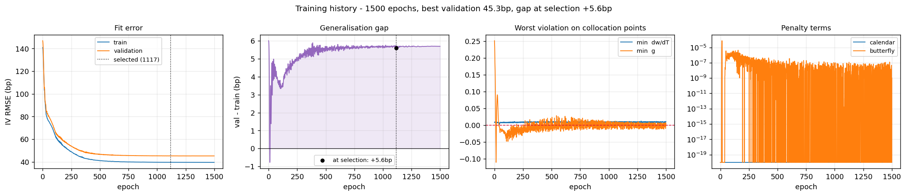

# Neural Implied-Volatility Surface

A neural network that fits the implied-volatility surface of a live equity option
chain **and cannot price arbitrage into it**.

Fitting a vol surface is a trade-off every practitioner runs into:

- Calibrate **SVI** to each expiry independently and you track the smiles
  beautifully — but nothing connects the slices, so interpolating between them
  produces calendar-spread arbitrage.
- Calibrate a joint **SSVI** surface and calendar arbitrage becomes impossible by
  construction — but three global shape parameters cannot follow a chain whose
  smile changes character between the front week and the one-year point.

This project closes that gap. A network learns a bounded correction to an SSVI
prior, trained under no-arbitrage penalties enforced on collocation points that
deliberately extend *beyond* the quoted strikes. It fits like the flexible model
and behaves like the safe one.

```bash
pip install -e .
python main.py          # or just press Run
```

No server, nothing to configure. `main.py` asks what you want to do:

```
  [1]  Train a surface        fit a chain, score it, plot everything
                              (~3 min: downloads live quotes)
  [2]  Price off a surface    query the one trained last time
                              (instant, no network)
  [3]  Compare trained models which archived run to use, and why
                              (instant, no network)
  [4]  Sweep architectures    is the network too small? fit several sizes
                              on one chain and table the answer
```

Then which underlying — **Train** takes any symbol typed on the spot, fetched
live on the fly; **Price** and **Compare** show what has actually been trained
(`available: SPY, AAPL, QQQ`) and let you pick, rather than making you remember
a ticker from three runs ago.

**Train** writes the report, the training curves and the arbitrage maps to
`results/`, and archives the model, the chain and the full training history
under `models/<ticker>_<timestamp>/` — every run kept, nothing overwritten.
**Price** loads the surface and queries it interactively: a strike and a
maturity in, implied vol / price / Greeks / local no-arbitrage check out, plus
the smile with your strike marked on it. **Compare** ranks every archived run by
validation error and generalisation gap, so after a few experiments there is an
answer to "which checkpoint do I actually use" instead of a folder of
`.pt` files to guess between.

Every option is also a command. `python main.py --help` generates the flag list
from [`config.py`](config.py) itself, so there is no second list to drift:

```bash
python main.py train --ticker AAPL --hidden 256x4 --epochs 3000
python main.py sweep --sweep-seeds 3          # the capacity study
python main.py train --chain-file results/spy_chain.npz --no-run-baselines
```

Settings live in [`config.py`](config.py); set `mode = "train"` and `ticker`
there to skip both prompts for a scheduled run.

📓 **[`notebook.ipynb`](notebook.ipynb)** — the same study written as a paper,
every claim backed by a runnable cell, committed with its outputs so it renders
in full on GitHub.
📘 **[`docs/USAGE.md`](docs/USAGE.md)** — the Jupyter workflow, the full API,
every config knob, troubleshooting.
⌨️ **[`docs/COMMANDS.md`](docs/COMMANDS.md)** — every runnable command in the
repo and what each one does: the four modes, all their flags, the tests, the
notebook, and recipes.
🧠 **[`docs/RED_NEURONAL.md`](docs/RED_NEURONAL.md)** — the network itself: what
it is, why it is small on purpose, and the design decisions behind it
(in Spanish).

---

## Result

Live SPY chain, 1,460 quotes across 8 expiries from 13 days to 1.8 years.
Every surface is scored by identical code:

```
surface                              IV RMSE   max err   px RMSE  in spread  cal viol  bfly viol
------------------------------------------------------------------------------------------------
Neural (SSVI prior + penalties)        40.8bp    648.3bp    0.3782      12.3%     0.00%      0.01%
Neural (flat prior + penalties)       685.2bp   4473.4bp    2.2550       1.2%     0.00%      0.09%
SVI (per-slice)                        65.6bp    652.3bp    0.6533       6.4%     0.00%      0.04%
SSVI (joint)                          142.2bp   1450.0bp    1.0403       2.3%     0.00%      0.00%
```

The neural surface fits **1.6× closer than per-slice SVI and 3.5× closer than
SSVI** in vol space and is the best of the three in price space. On the dense
grid it leaves a single point of 7,381 with a shallow butterfly dent
(`g = −1.4e−2`, at `T = 0.018y` — half the shortest listed expiry, deep in
maturity extrapolation); per-slice SVI leaves three, inside the quoted range.
Raising the butterfly weight shrinks that dent without removing it, at a cost of
a few tenths of a basis point on the fit, so the default stays where it is and
the number is reported rather than tuned away.

The second row is the ablation, and it is the one to read first: **the same
network, same budget, same penalties, against a flat constant-vol prior instead
of SSVI — 685bp.** The bounded parametrisation `w = w_prior·[1 + α·tanh(net)]`
with `α = 0.35` presupposes a prior that is already roughly right; a ±35%
correction around a constant cannot represent a smile at all. What the headline
number measures is the prior and the network *together*, and that is the honest
way to state it.

Full run in [`docs/example_report.txt`](docs/example_report.txt); the network
itself is documented in [`docs/RED_NEURONAL.md`](docs/RED_NEURONAL.md).


Shaded bands are where no options trade — the region a surface has to invent.

The training itself, not just the result — fit, generalisation gap, whether the
constraints are actually binding:



The held-out strikes span the whole smile, wings included, so validation sits a
little *above* training — 45.3bp against 39.6bp. A gap that size and flat is
what "this will hold up on tomorrow's chain" looks like; validation below
training would mean the split was quietly holding out only the easy points. The
third panel is the constraints crossing into compliance during warm-up and
staying there while the fit keeps improving, and the epoch that gets shipped is
the best one that was *clean* on its own collocation draw, not merely the best
one.

### Is the network too small?

8,769 parameters is a small network, and "make it bigger" is the first thing
anyone says. `python main.py sweep` answers it with a number instead of an
opinion. The table below is 18 fits — six architectures, three seeds, all on the
same chain, same split, same budget, same penalties:

```bash
python main.py sweep --sweep-architectures 32x2,64x3,128x3,256x4,512x4,1024x4 \
                     --sweep-seeds 3 --chain-file results/spy_chain.npz
```

```
    arch     params     train       val  vs default    bfly     time
    32x2      1,281     39.5bp     45.2bp     +0.8bp   0.02%      56s
    64x3      8,769     38.7bp     44.4bp        --    0.01%      75s
   128x3     33,921     37.6bp     43.5bp     -0.9bp   0.02%     132s
   256x4    199,169     38.3bp     44.0bp     -0.4bp   0.02%    ~370s
   512x4    791,553     36.7bp     42.6bp     -1.8bp   0.02%   ~1230s
  1024x4  3,155,969     36.5bp     42.3bp     -2.1bp   0.03%   ~3100s
```

**360× the parameters buys 2.1bp — 4.7% — for ~40× the training time**, and
seed-to-seed scatter within one architecture is 1–4bp, so most of that column is
noise. Training error barely moves either (39.5 → 36.5bp while parameters go up
2,500×), which is the signature of a problem where the model is not the binding
constraint: the chain carries a few dozen effective degrees of freedom and the
error floor is the bid-ask. Arbitrage violations get marginally *worse* with
capacity, because a bigger network has more ways to bend the surface where no
quote is holding it down.


The default stays at 64×3. `--hidden 512x4` is one flag away if you want the
other end of that curve.


Durrleman's `g` and `dw/dT` across the whole plane; red would be arbitrage.
Compare [`arbitrage_svi.png`](docs/figures/arbitrage_svi.png), where the naive
per-slice construction breaks down between listed expiries.

---

## How it works

### 1. The chain is cleaned properly — [`volsurface/data/`](volsurface/data/)

One module per decision: [`clean.py`](volsurface/data/clean.py) holds every
filter, [`forward.py`](volsurface/data/forward.py) the parity fit,
[`fetch.py`](volsurface/data/fetch.py) the download, and
[`synthetic.py`](volsurface/data/synthetic.py) the offline generator.

Surface quality is decided here, not in the model.

**The forward and discount factor are implied from the market, not assumed.**
Put-call parity gives `C(K) − P(K) = DF·(F − K)`, a straight line in `K`; a
weighted regression over the liquid matched strikes returns both `DF` and the
forward the market is actually trading. This removes the systematic skew tilt a
wrong dividend assumption produces.

**Out-of-the-money quotes only** — calls above the forward, puts below. The ITM
wing carries the same information with a wider spread.

**Implied vols are computed in-house**, from `mid/DF` in the forward measure,
consistent with the fitted forward rather than with a vendor's rate and dividend
assumptions.

**Quotes are weighted by vega / spread.** Unweighted least squares in vol space
chases deep wing options whose volatility is barely identified by their price.

### 2. The American problem — [`volsurface/pricing/american.py`](volsurface/pricing/american.py)

SPY options are **American**. A European inversion has nowhere to put the
early-exercise premium and charges it to volatility. Measured on the chain above:

```
removed 13.26bp of vol on average (median 0.47, p95 65.65, max 280.21)
  calls   0.16bp mean   puts  20.27bp mean
  T in [0.00, 0.15)  n= 406  mean   0.36bp  p95   1.85bp
  T in [0.15, 0.50)  n= 308  mean   9.49bp  p95  36.15bp
  T in [0.50, 1.00)  n= 165  mean  10.76bp  p95  50.49bp
  T >= 1.00          n= 581  mean  24.98bp  p95 119.12bp
```

Exactly where theory says it should be: nothing in the calls, everything in the
puts, growing with maturity. Against a fit measured at 41bp, ignoring it would
have been a bias of the same order as the thing being fitted.

So the quotes are **de-Americanised** before they reach the surface. The premium
is priced on a binomial lattice and stripped out:

```
sigma  ←  IV_BS( price − [ CRR_american(sigma) − CRR_european(sigma) ] )
```

iterated to a fixed point. The premium is a difference of two prices off the
*same* lattice at the *same* sigma, so the tree's discretisation error cancels —
which is why 150 steps suffice where pricing to that accuracy would need far
more. The surface stays European and arbitrage-free; only the data stops being
biased.

That has a second consequence, and it is the part most implementations miss:
**put-call parity is a theorem about European options**, so the forward fitted in
step 1 from raw American mids is biased too — by close to 1% on an 18-month
expiry. The two unknowns are circular (you need the forward to de-Americanise,
and de-Americanised quotes to fit the forward), so `fit_forward` runs them as a
short fixed point. Two passes cut the forward error by 7×.

### 3. The model is a bounded correction, not a free-form fit — [`volsurface/surfaces/neural/model.py`](volsurface/surfaces/neural/model.py)

```
w(k, T) = w_SSVI(k, T) · [ 1 + α·tanh( net(k, T) ) ]
```

Three properties follow from that one line:

- **Positivity is structural.** `w_SSVI > 0` and the bracket lives in
  `[1−α, 1+α]`, so total variance is positive everywhere. No clamping, no NaN in
  `sqrt(w)`.
- **Extrapolation degrades to SSVI, not to noise.** Far outside the quoted
  strikes the network saturates and the surface becomes a fixed multiple of an
  arbitrage-free parametric surface.
- **The error is bounded before training starts.** With `α = 0.35` the fit is
  never more than ~16% away from SSVI in vol terms — a guarantee you can state in
  advance.

The output layer is zero-initialised, so the model *starts* exactly at the prior
and a failed run degrades to SSVI rather than to garbage.

Inputs are `(k, √T, k/√T, k², k·√T)`. Standardised moneyness `k/√T` matters: it
is the coordinate in which smiles across maturities look alike, and handing it to
the network saves it from learning the `√T` scaling from a few hundred points.

### 4. No-arbitrage is enforced where there is no data — [`volsurface/surfaces/neural/arbitrage.py`](volsurface/surfaces/neural/arbitrage.py)

```
calendar    ∂w/∂T  ≥ 0
butterfly   g(k,T) ≥ 0,   g = (1 − k·w_k/2w)² − (w_k²/4)(¼ + 1/w) + w_kk/2
```

Each becomes `mean(relu(−violation)²)`: zero when satisfied, quadratic in the
depth of the breach. All derivatives come from `torch.autograd` with
`create_graph=True` — exact, no finite-difference error floor.

**Where they are evaluated matters more than their weight.** They are imposed on
random collocation points over a region 30% wider in strike than the quotes and
past the last listed expiry, resampled every epoch. Constraining the surface only
where quotes exist is nearly free and nearly useless: the wings and the gaps
between expiries are exactly where an interpolating network invents negative
densities.

This is why the model runs in float64 with a smooth activation — the butterfly
penalty differentiates twice, and a ReLU network has zero second derivative
almost everywhere.

### 5. Everything is scored by the same code — [`volsurface/evaluation/diagnostics.py`](volsurface/evaluation/diagnostics.py)

Neural, SVI and SSVI all implement `volsurface.surfaces.base.VolSurface`, so they pass
through identical fit reports and arbitrage scans. Reporting fit *and* arbitrage
together is the point: a comparison showing only RMSE ranks the wrong model
first.

---

## Layout

Four packages, each named after the question it answers. **The network is in
[`volsurface/surfaces/neural/`](volsurface/surfaces/neural/)**, next to the
parametric baselines it is compared against, because it is one more
implementation of the same interface — which is what lets identical code score
all three.

```
main.py                        the study, start to finish — press Run
cli.py                         the flag list, generated from RunConfig
config.py                      every knob, one file
notebook.ipynb                 the same study as a paper, with outputs

volsurface/
    pricing/                   WHAT A PRICE IS  (primitives, no internal deps)
        blackscholes.py        closed-form price and Greeks
        impliedvol.py          inversion, with an identifiability guard
        american.py            binomial lattice; de-Americanisation
        montecarlo.py          independent numerical check on the analytic formula

    surfaces/                  THE MODELS
        base.py                the VolSurface interface — everything is total variance
        svi.py                 raw SVI (quasi-explicit) and joint SSVI
        neural/                ** the network **
            prior.py           SSVI in torch, differentiable end to end
            model.py           prior x bounded correction
            arbitrage.py       autodiff penalties on collocation points
            dataset.py         tensors and the stratified split
            train.py           vega-weighted objective, warm-up, feasible-epoch selection

    data/                      WHERE THE QUOTES COME FROM
        fetch.py               the live Yahoo Finance chain
        clean.py               raw frames -> clean chain; every filter lives here
        forward.py             forward + discount from put-call parity
        snapshot.py            ChainSnapshot — the only structure that leaves here
        synthetic.py           ** the offline data generator ** — a chain from a
                               known arbitrage-free SSVI surface
        conventions.py         day counts

    evaluation/                HOW A SURFACE IS JUDGED
        diagnostics.py         fit reports and the dense-grid arbitrage scan
        report.py              scorecards, curves, smiles, arbitrage maps, the
                               capacity table
        registry.py            archive of trained runs — which checkpoint to use

    quote.py                   USING A FITTED SURFACE
                               strike + expiry date + side -> price, Greeks, caveats

tests/                         161 tests, no network required
```

The packages are listed in dependency order, and that order is enforced:

```
pricing  ->  surfaces  ->  data  ->  evaluation  ->  quote
```

`pricing` is primitives and imports nothing else here. `data` needs both
(cleaning inverts implied vols and de-Americanises; the generator samples a
known SSVI surface). `evaluation` needs a chain and a surface to judge.
`quote` consumes all four, which is why it sits above them rather than inside
`pricing/` — filing it there put a cycle in the graph.
[`tests/test_layout.py`](tests/test_layout.py) reads the import graph out of the
source and fails if any of that stops being true, because a structure nobody
checks decays back into a flat namespace one convenient import at a time.

Every public name is re-exported from `volsurface` itself, so the layout is for
reading the code, not a tax on using it: `from volsurface import price_option`
works regardless of which package it lives in.

## Using it as a library

Full reference in [`docs/USAGE.md`](docs/USAGE.md).

```python
from volsurface import fetch_chain, train_surface, compare, comparison_table

chain  = fetch_chain("SPY")
result = train_surface(chain)

print(comparison_table(compare(chain, result)))
```

To price an actual option — the strike, the expiry date and the side, the way
one is named — `price_option` is the only entry point you need:

```python
from volsurface import price_option

q = price_option(result.model, chain, strike=780, expiry="2026-12-19", kind="put")

q.price            # 24.2961
q.implied_vol      # 0.1354
q.delta            # -0.5110   (forward delta; q.delta_spot for the spot one)
q.is_extrapolated  # False -- there were quotes near this strike and expiry
q.arbitrage_free   # True  -- dw/dT and Durrleman g both >= 0 right here
print(q.summary())
```

The expiry can be a date, a year fraction (`0.25`) or days (`"45d"`); a date is
measured against the day the *chain* was snapshotted, not against today, so a
surface fitted last Tuesday keeps pricing a December expiry at the maturity it
had last Tuesday. The forward and the discount factor come from the chain,
where they were fitted from put-call parity — pricing against a spot and an
assumed carry would quote the vol against a different forward than the one it
was calibrated in.

`use_live_data = False` in `config.py` (or `synthetic_snapshot()`) generates a
chain from a known arbitrage-free SSVI surface — useful because any violation
the diagnostics report on it is a defect in the *model*, not a feature of the
market. On that data per-slice SVI edges the network out on RMSE and violates
nothing, which is the expected result and worth stating: the network earns its
keep on real quotes, not on data a parametric model already describes exactly.

## Three things the tests pin down

**Implied vol is not always recoverable.** At `S=100, K=70, T=0.6` every sigma
below ~7% produces the *identical* float64. Any root finder returns a number and
that number is meaningless, so `impliedvol` refuses instead — a silently wrong IV
would enter the surface fit as a real data point.

**SVI cannot be calibrated by a naive five-parameter search.** The objective has
long flat valleys where `ρ → −1` trades off against `σ → 0`; a simplex started at
a fixed point walks into them and returns a degenerate slice with a large
negative `a`. It looks converged and prices nonsense. `svi.py` uses the Zeliade
quasi-explicit method: for fixed `(m, σ)` the model is *linear* in the rest, so a
constrained linear least squares sits inside a 2-D multi-start search.

**A dividend yield must enter the lattice drift, not the spot.** Folding it in as
`S·e^{−qT}` reproduces the European price exactly — which is why it is tempting —
and puts the American exercise boundary in the wrong place.

```bash
pytest
```

## References

- Gatheral (2004), *A parsimonious arbitrage-free implied volatility parameterization*
- Gatheral & Jacquier (2014), *Arbitrage-Free SVI Volatility Surfaces*
- Roper (2010), *Arbitrage Free Implied Volatility Surfaces*
- Zeliade Systems (2009), *Quasi-Explicit Calibration of Gatheral's SVI Model*
- Ackerer, Tagasovska & Vatter (2020), *Deep Smoothing of the Implied Volatility Surface*

## License

MIT — see [LICENSE](LICENSE).
