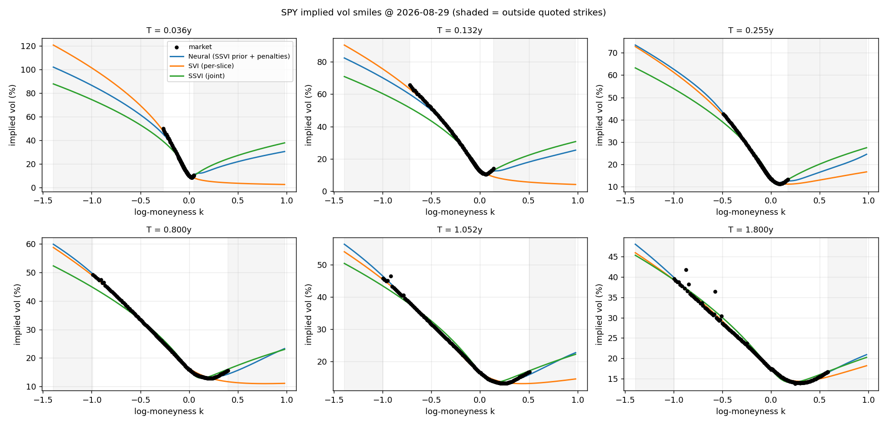
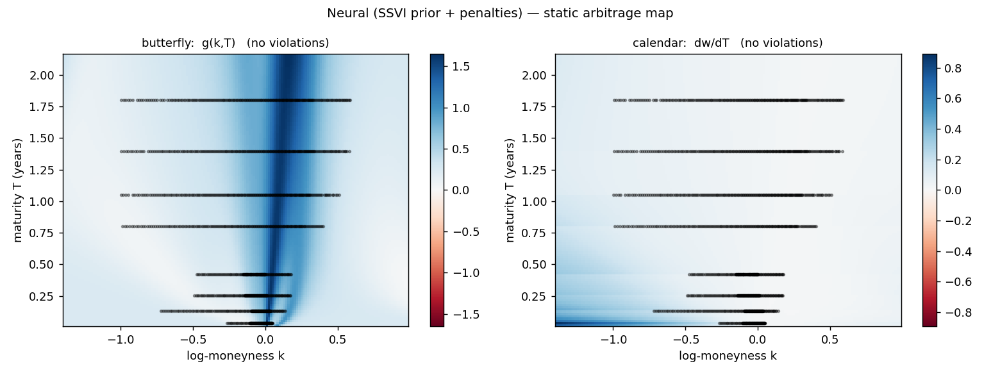

# Neural Implied-Volatility Surface

A neural network that fits the implied-volatility surface of a live equity option
chain **and cannot price arbitrage into it**.

Fitting a vol surface is a trade-off every practitioner runs into:

- Calibrate **SVI** to each expiry independently and you track the smiles
  beautifully — but nothing connects the slices, so interpolating between them
  produces calendar-spread arbitrage.
- Calibrate a joint **SSVI** surface and calendar arbitrage becomes impossible by
  construction — but three global shape parameters cannot follow a chain whose
  smile changes character between the front week and the one-year point.

This project closes that gap. A network learns a bounded correction to an SSVI
prior, trained under no-arbitrage penalties enforced on collocation points that
deliberately extend *beyond* the quoted strikes. It fits like the flexible model
and behaves like the safe one.

```bash
pip install -e .
python main.py          # or just press Run
```

No server, no flags, no arguments. Settings live in [`config.py`](config.py);
output lands in `results/`.

---

## Result

Live SPY chain, 1,400 quotes across 8 expiries from 13 days to 1.8 years.
Every surface is scored by identical code:

```
surface                              IV RMSE   max err   px RMSE  in spread  cal viol  bfly viol
------------------------------------------------------------------------------------------------
Neural (SSVI prior + penalties)        31.7bp    598.6bp    0.3587       8.9%     0.00%      0.00%
SVI (per-slice)                        49.3bp    558.4bp    0.5783       5.6%     0.81%      0.05%
SSVI (joint)                          115.8bp   1414.8bp    1.0710       2.1%     0.00%      0.00%
```

The neural surface fits **1.6× closer than per-slice SVI and 3.7× closer than
SSVI** in vol space, is the best of the three in price space, and is the only one
of the two arbitrage-free surfaces that fits. Full run in
[`docs/example_report.txt`](docs/example_report.txt).



Shaded bands are where no options trade — the region a surface has to invent.



Durrleman's `g` and `dw/dT` across the whole plane; red would be arbitrage.
Compare [`arbitrage_svi.png`](docs/figures/arbitrage_svi.png), where the naive
per-slice construction breaks down between listed expiries.

---

## How it works

### 1. The chain is cleaned properly — [`volsurface/chain.py`](volsurface/chain.py)

Surface quality is decided here, not in the model.

**The forward and discount factor are implied from the market, not assumed.**
Put-call parity gives `C(K) − P(K) = DF·(F − K)`, a straight line in `K`; a
weighted regression over the liquid matched strikes returns both `DF` and the
forward the market is actually trading. This removes the systematic skew tilt a
wrong dividend assumption produces.

**Out-of-the-money quotes only** — calls above the forward, puts below. The ITM
wing carries the same information with a wider spread.

**Implied vols are computed in-house**, from `mid/DF` in the forward measure,
consistent with the fitted forward rather than with a vendor's rate and dividend
assumptions.

**Quotes are weighted by vega / spread.** Unweighted least squares in vol space
chases deep wing options whose volatility is barely identified by their price.

### 2. The American problem — [`volsurface/american.py`](volsurface/american.py)

SPY options are **American**. A European inversion has nowhere to put the
early-exercise premium and charges it to volatility. Measured on the chain above:

```
removed 13.27bp of vol on average (median 0.99, p95 67.85, max 262.53)
  calls   0.27bp mean   puts  20.16bp mean
  T in [0.00, 0.15)  n= 321  mean   0.41bp  p95   2.38bp
  T in [0.15, 0.50)  n= 341  mean   7.43bp  p95  26.88bp
  T in [0.50, 1.00)  n= 164  mean  10.98bp  p95  50.63bp
  T >= 1.00          n= 574  mean  24.59bp  p95 116.61bp
```

Exactly where theory says it should be: nothing in the calls, everything in the
puts, growing with maturity. Against a fit measured at 32bp, ignoring it would
have been a bias larger than the thing being fitted.

So the quotes are **de-Americanised** before they reach the surface. The premium
is priced on a binomial lattice and stripped out:

```
sigma  ←  IV_BS( price − [ CRR_american(sigma) − CRR_european(sigma) ] )
```

iterated to a fixed point. The premium is a difference of two prices off the
*same* lattice at the *same* sigma, so the tree's discretisation error cancels —
which is why 150 steps suffice where pricing to that accuracy would need far
more. The surface stays European and arbitrage-free; only the data stops being
biased.

That has a second consequence, and it is the part most implementations miss:
**put-call parity is a theorem about European options**, so the forward fitted in
step 1 from raw American mids is biased too — by close to 1% on an 18-month
expiry. The two unknowns are circular (you need the forward to de-Americanise,
and de-Americanised quotes to fit the forward), so `fit_forward` runs them as a
short fixed point. Two passes cut the forward error by 7×.

### 3. The model is a bounded correction, not a free-form fit — [`volsurface/neural/model.py`](volsurface/neural/model.py)

```
w(k, T) = w_SSVI(k, T) · [ 1 + α·tanh( net(k, T) ) ]
```

Three properties follow from that one line:

- **Positivity is structural.** `w_SSVI > 0` and the bracket lives in
  `[1−α, 1+α]`, so total variance is positive everywhere. No clamping, no NaN in
  `sqrt(w)`.
- **Extrapolation degrades to SSVI, not to noise.** Far outside the quoted
  strikes the network saturates and the surface becomes a fixed multiple of an
  arbitrage-free parametric surface.
- **The error is bounded before training starts.** With `α = 0.35` the fit is
  never more than ~16% away from SSVI in vol terms — a guarantee you can state in
  advance.

The output layer is zero-initialised, so the model *starts* exactly at the prior
and a failed run degrades to SSVI rather than to garbage.

Inputs are `(k, √T, k/√T, k², k·√T)`. Standardised moneyness `k/√T` matters: it
is the coordinate in which smiles across maturities look alike, and handing it to
the network saves it from learning the `√T` scaling from a few hundred points.

### 4. No-arbitrage is enforced where there is no data — [`volsurface/neural/arbitrage.py`](volsurface/neural/arbitrage.py)

```
calendar    ∂w/∂T  ≥ 0
butterfly   g(k,T) ≥ 0,   g = (1 − k·w_k/2w)² − (w_k²/4)(¼ + 1/w) + w_kk/2
```

Each becomes `mean(relu(−violation)²)`: zero when satisfied, quadratic in the
depth of the breach. All derivatives come from `torch.autograd` with
`create_graph=True` — exact, no finite-difference error floor.

**Where they are evaluated matters more than their weight.** They are imposed on
random collocation points over a region 30% wider in strike than the quotes and
past the last listed expiry, resampled every epoch. Constraining the surface only
where quotes exist is nearly free and nearly useless: the wings and the gaps
between expiries are exactly where an interpolating network invents negative
densities.

This is why the model runs in float64 with a smooth activation — the butterfly
penalty differentiates twice, and a ReLU network has zero second derivative
almost everywhere.

### 5. Everything is scored by the same code — [`volsurface/diagnostics.py`](volsurface/diagnostics.py)

Neural, SVI and SSVI all implement `volsurface.surface.VolSurface`, so they pass
through identical fit reports and arbitrage scans. Reporting fit *and* arbitrage
together is the point: a comparison showing only RMSE ranks the wrong model
first.

---

## Layout

```
main.py                    the study, start to finish — press Run
config.py                  every knob, one file
volsurface/
    chain.py               option chain -> clean (k, T, IV) cloud
    american.py            binomial tree; de-Americanisation
    blackscholes.py        closed-form price and Greeks
    impliedvol.py          inversion, with an identifiability guard
    surface.py             the VolSurface interface — everything is total variance
    diagnostics.py         arbitrage scans and fit reports
    svi.py                 raw SVI (quasi-explicit) and joint SSVI
    report.py              scorecards and figures
    montecarlo.py          independent numerical check on the analytic formula
    conventions.py         day counts
    neural/
        prior.py           SSVI in torch, differentiable end to end
        model.py           prior x bounded correction
        arbitrage.py       autodiff penalties on collocation points
        dataset.py         tensors and the stratified split
        train.py           vega-weighted objective, penalty warm-up, early stopping
tests/                     72 tests, no network required
```

## Using it as a library

```python
from volsurface import fetch_chain, train_surface, compare, comparison_table

chain  = fetch_chain("SPY")
result = train_surface(chain)

print(comparison_table(compare(chain, result)))
print(result.model.implied_vol([-0.1, 0.0, 0.1], [0.5, 0.5, 0.5]))
```

`use_live_data = False` in `config.py` (or `synthetic_snapshot()`) generates a
chain from a known arbitrage-free SSVI surface — useful because any violation
the diagnostics report on it is a defect in the *model*, not a feature of the
market. On that data per-slice SVI edges the network out on RMSE and violates
nothing, which is the expected result and worth stating: the network earns its
keep on real quotes, not on data a parametric model already describes exactly.

## Three things the tests pin down

**Implied vol is not always recoverable.** At `S=100, K=70, T=0.6` every sigma
below ~7% produces the *identical* float64. Any root finder returns a number and
that number is meaningless, so `impliedvol` refuses instead — a silently wrong IV
would enter the surface fit as a real data point.

**SVI cannot be calibrated by a naive five-parameter search.** The objective has
long flat valleys where `ρ → −1` trades off against `σ → 0`; a simplex started at
a fixed point walks into them and returns a degenerate slice with a large
negative `a`. It looks converged and prices nonsense. `svi.py` uses the Zeliade
quasi-explicit method: for fixed `(m, σ)` the model is *linear* in the rest, so a
constrained linear least squares sits inside a 2-D multi-start search.

**A dividend yield must enter the lattice drift, not the spot.** Folding it in as
`S·e^{−qT}` reproduces the European price exactly — which is why it is tempting —
and puts the American exercise boundary in the wrong place.

```bash
pytest
```

## References

- Gatheral (2004), *A parsimonious arbitrage-free implied volatility parameterization*
- Gatheral & Jacquier (2014), *Arbitrage-Free SVI Volatility Surfaces*
- Roper (2010), *Arbitrage Free Implied Volatility Surfaces*
- Zeliade Systems (2009), *Quasi-Explicit Calibration of Gatheral's SVI Model*
- Ackerer, Tagasovska & Vatter (2020), *Deep Smoothing of the Implied Volatility Surface*

## License

MIT — see [LICENSE](LICENSE).
