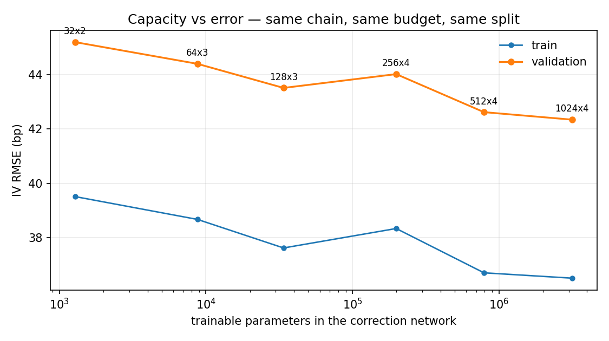

# La red neuronal: qué es, dónde está y por qué tiene esa forma

Documento de referencia sobre la parte de *deep learning* del proyecto: dónde
vive el modelo, qué tipo de red es, qué decisiones de diseño lo definen y qué
evidencia las respalda.

---

## 1. Dónde está

Todo el código de la red vive en un único paquete, `volsurface/neural/`, con 948
líneas repartidas en cinco archivos (más un `__init__.py` de 35):

| Archivo | Líneas | Qué contiene |
|---|---|---|
| `volsurface/neural/model.py` | 270 | **La red.** `NeuralVolSurface`, el MLP y la envoltura de la superficie |
| `volsurface/neural/prior.py` | 115 | El *prior* SSVI reimplementado en torch (`TorchSSVIPrior`) y la ablación `FlatPrior` |
| `volsurface/neural/arbitrage.py` | 152 | Las penalizaciones de no-arbitraje (calendar y mariposa) y los puntos de colocación |
| `volsurface/neural/dataset.py` | 112 | Cadena -> tensores, y el split train/validación estratificado |
| `volsurface/neural/train.py` | 299 | El bucle de entrenamiento: objetivo, warm-up, early stopping |

La definición literal de la red son unas 10 líneas de
**`volsurface/neural/model.py`**, dentro de `__init__`:

```python
layers = []
in_dim = 5
for h in self.config.hidden:                  # (64, 64, 64)
    layers += [nn.Linear(in_dim, h), act()]   # act = SiLU
    in_dim = h
layers.append(nn.Linear(in_dim, 1))
self.net = nn.Sequential(*layers)
```

---

## 2. Qué tipo de red es

**Un perceptrón multicapa (MLP) totalmente conectado, denso, feed-forward.**
Nada de convoluciones, recurrencia, atención ni transformers.

```
entrada (5)  ->  Linear 5x64  -> SiLU
             ->  Linear 64x64 -> SiLU
             ->  Linear 64x64 -> SiLU
             ->  Linear 64x1
salida (1 escalar)
```

- **8.769 parámetros entrenables.** Para comparar: un ResNet-50 tiene 25
  millones. Es una red diminuta, y lo es a propósito: la sección 5 mide el coste
  de agrandarla.
- **Todo en `float64`** (`self.double()`). Poco habitual en deep learning, y
  aquí es deliberado: la penalización de mariposa necesita la *segunda*
  derivada de la salida de la red respecto a `k`, y en `float32` la curvatura
  de una superficie suave está al límite de lo que el grafo de autograd
  expresa limpiamente.
- **Activación SiLU**, no ReLU. También deliberado: una red ReLU tiene segunda
  derivada nula casi en todas partes, así que la penalización de mariposa
  sería literalmente ciega a la curvatura. SiLU es suave e infinitamente
  diferenciable.
- **Optimizador Adam** full-batch (sin mini-batches), `lr = 3e-3`, coseno
  decreciente, `weight_decay = 1e-6`, clipping de gradiente a norma 10.
- **1.500 épocas**, ~75 segundos en CPU.

### Lo que la red **no** predice

Aquí está el punto de diseño que explica la forma del código. La red **no** saca
volatilidad implícita. **Ni siquiera** saca varianza total. Saca una
**corrección multiplicativa acotada a una superficie SSVI ya calibrada**:

```
w(k, T) = w_SSVI(k, T) * [ 1 + alpha * tanh( net(features(k, T)) ) ]      alpha = 0.35
```

donde `w = sigma^2 * T` es la varianza total y `k = log(K/F_T)` la
log-moneyness.

La `tanh` acota la salida en `[-1, 1]`, así que el corchete vive en
`[1-alpha, 1+alpha] = [0.65, 1.35]`. De esa única línea salen tres propiedades:

1. **Positividad estructural.** `w_SSVI > 0` y el corchete es estrictamente
   positivo -> `w > 0` en todo el dominio, por construcción. Sin penalización,
   sin clamps, sin NaN en `sqrt(w)`.
2. **La extrapolación degenera a SSVI, no a ruido.** Lejos de los strikes
   cotizados la red satura en una constante y la superficie se convierte en un
   múltiplo fijo de una superficie paramétrica libre de arbitraje. Una red sin
   prior que prediga `w` directamente extrapola lo que le salga de la última
   capa oculta — así es como las superficies neuronales acaban valorando
   densidades negativas dos strikes más allá de la última cotización.
3. **El error está acotado *a priori*.** Con `alpha = 0.35`, la superficie
   ajustada nunca se aleja más de ~16% de SSVI en términos de vol. Es una
   garantía enunciable antes de que el modelo vea un solo dato.

Y un cuarto detalle que refuerza lo anterior: la **última capa se inicializa a
cero** (`nn.init.zeros_` en peso y bias). El modelo *nace siendo exactamente
SSVI*. El entrenamiento sólo tiene que explicar el residuo, y un entrenamiento
fallido degrada a SSVI en vez de a ruido.

### Las entradas (5 features)

`(k, T)` es una mala base de entrada. La sonrisa no vive en log-moneyness, vive
en log-moneyness **estandarizada** `z = k/sqrt(T)` — la coordenada en la que
las sonrisas de distintos vencimientos se parecen entre sí. Dársela hecha
ahorra a la red tener que aprender el escalado `sqrt(T)` a partir de unos
cientos de puntos.

```
raw_features = (k, sqrt(T), k/sqrt(T), k^2, k*sqrt(T))
```

luego estandarizadas a media 0 / varianza 1 con estadísticos **congelados del
set de entrenamiento** (guardados como buffers, así que viajan con el
checkpoint). Los términos `k^2` y `k*sqrt(T)` son features polinómicas
explícitas: le dan a la red la curvatura y la interacción strike-plazo sin
gastar capas en construirlas.

---

## 3. La función de pérdida

Esto es lo que hace que el proyecto sea algo más que "meterle un MLP a unos
datos". Está en `volsurface/neural/train.py`:

```
L  =  suma_i  weight_i * (sigma_modelo(k_i,T_i) - sigma_mercado_i)^2   <- ajuste
   +  lambda_cal  * mean( relu(-dw/dT)^2 )   en colocación             <- calendar
   +  lambda_bfly * mean( relu(-g)^2 )       en colocación             <- mariposa
```

con `lambda_cal = 10.0`, `lambda_bfly = 1.0`.

**Término de ajuste.** Dos decisiones:

- Se ajusta en **espacio de vol, no de varianza total**. La varianza total es
  la coordenada correcta para las restricciones, pero su escala crece con el
  vencimiento: minimizarla pondera la sonrisa de un año diez veces más que la
  de un mes, silenciosamente. Los errores en vol son lo que cotiza un trader.
- Las cotizaciones van **ponderadas por vega/spread**
  (`volsurface/chain.py`, ~línea 465). Un error de vol en una opción de ala con
  vega 0.05 vale mucho menos que el mismo error en el at-the-money.

**Términos de penalización.** Son las dos condiciones estáticas de no-arbitraje
(Roper 2010; Gatheral & Jacquier 2014):

- **Calendar spread:** `dw/dT >= 0`. Violarlo significa que una opción de plazo
  más largo vale menos que una más corta al mismo moneyness relativo.
- **Mariposa:** la función de Durrleman
  `g = (1 - k*w_k/2w)^2 - (w_k^2/4)(1/4 + 1/w) + w_kk/2 >= 0`.
  Violarlo significa que la superficie implica una densidad de probabilidad
  negativa.

Cada una se convierte en `mean(relu(-violación)^2)`: cero donde la condición se
cumple (una superficie limpia no paga nada) y cuadrática en la profundidad de
la violación. Un hinge sin cuadrado empujaría con fuerza constante da igual la
gravedad, y tiende a oscilar alrededor de la frontera.

### El detalle que más importa: **dónde** se evalúan las penalizaciones

No en los datos. En **puntos de colocación aleatorios** sobre una caja
deliberadamente más ancha que las cotizaciones (`arbitrage.py`,
`CollocationRegion`):

- log-moneyness: 30% más allá de los strikes extremos, uniforme
- vencimiento: desde 0.5x el más corto hasta 1.3x el más largo, uniforme en
  `sqrt(T)` — densidad `1/sqrt(T)`, que carga los puntos al frente de la curva,
  donde la varianza total es pequeña y la densidad se rompe primero
- **2.048 puntos, remuestreados en cada época**

Restringir la superficie sólo donde hay cotizaciones es casi gratis y casi
inútil: las alas y los huecos entre vencimientos son exactamente donde una red
interpoladora se inventa densidades negativas. Y remuestrear cada época, en vez
de fijar una malla, impide que la red aprenda a cumplir la restricción en un
conjunto finito de puntos violándola entre ellos.

Las derivadas salen de `torch.autograd.grad(..., create_graph=True)`, así que
la penalización se vuelve a diferenciar durante el backprop. Ésa es la razón
real del `float64` y de SiLU.

### El bucle

- **Warm-up:** las penalizaciones entran linealmente durante las primeras 300
  épocas. Arrancar a peso completo hace que la red satisfaga las restricciones
  trivialmente quedándose sentada en el prior (cosa que puede hacer desde el
  paso cero, por la inicialización a cero), y desde ahí el término de ajuste ya
  no la mueve. `TrainConfig.__post_init__` acota el warm-up a un quinto del
  presupuesto, para que una corrida corta no termine sin haber registrado
  ningún candidato.
- **Early stopping** sobre el RMSE de validación **sin penalizar**: las
  penalizaciones son un medio para una superficie usable, no parte de lo que se
  mide. `patience = 400`, y el contador se mantiene en cero durante el warm-up
  — si corriera desde la época 0, el margen efectivo serían ~100 épocas en vez
  de 400.
- La selección del "mejor modelo" no empieza hasta terminado el warm-up, y sólo
  considera epochs **factibles** — limpios de arbitraje en su propio sorteo de
  colocación. Un epoch con mejor error pero con una violación no se lleva el
  puesto; si ninguno es factible, la corrida cae al criterio por error y lo dice
  explícitamente (`TrainResult.best_is_feasible`). Las penalizaciones son
  *blandas*, así que sin este criterio una corrida puede converger a un error de
  validación bajo dejando una abolladura de mariposa en un rincón de la región
  de extrapolación, y es esa abolladura la que se guardaría.
- Todo el diagnóstico de un epoch se mide sobre **los pesos que produjeron la
  pérdida**, con el paso del optimizador al final del bucle. Medir las
  penalizaciones antes de `opt.step()` y los RMSE después hace que el historial
  describa dos vectores de pesos distintos: inofensivo mientras sólo se mira la
  curva, fatal en el momento en que la selección depende de la factibilidad.

---

## 4. Cómo encaja en el resto del repo

La red es la última pieza de un pipeline en el que casi todo el trabajo real
está **antes**:

```
Yahoo Finance
   |  volsurface/chain.py
   +- filtro de liquidez (dos lados, OI >= 10, spread <= 25% del mid)
   +- forward y factor de descuento implícitos por paridad put-call
   |     C(K) - P(K) = DF*(F - K)  -> mínimos cuadrados sobre strikes emparejados
   +- selección sólo OTM (calls sobre el forward, puts debajo)
   +- inversión de IV propia (volsurface/impliedvol.py)
   +- de-americanización en árbol binomial (volsurface/american.py)
         -> en SPY quita 13.26bp de vol de media, 24.98bp más allá de un año,
            y casi todo está en los puts
   |
   v  ChainSnapshot: 1.460 cotizaciones limpias, 8 vencimientos
   |
   +- volsurface/svi.py       -> baselines: SVI por slice y SSVI conjunta
   |                              (SSVI es además el prior de la red)
   +- volsurface/neural/      -> la red
   |
   v  volsurface/diagnostics.py  -> escaneo de arbitraje en malla densa
      volsurface/report.py       -> el scorecard
```

`NeuralVolSurface` hereda de `VolSurface` (`volsurface/surface.py`), la misma
interfaz abstracta que los baselines paramétricos. Sólo hay que implementar
`total_variance(k, T)` y salen gratis IV, precios y todo el suite de
diagnósticos. La red **se puntúa con exactamente el mismo código** que SVI y
SSVI — sin esto, la comparación no valdría nada. La única diferencia es que
sobrescribe `dw_dk`, `d2w_dk2` y `dw_dT` para usar autograd en lugar de
diferencias finitas.

Detalles de implementación en esa frontera:

- `_grads` computa las tres derivadas de una vez, así que las tres propiedades
  comparten una **caché de una entrada** con clave en los bytes de `(k, T)`,
  invalidada al cambiar de modo o al cargar pesos. Sin ella, un escaneo de
  arbitraje en malla densa paga 3x el coste necesario.
- `dw_dk(self, k, T, h=0.0)` acepta un `h` que ignora: es el paso de
  diferencias finitas de la firma de la clase base, y estas derivadas son
  exactas.
- Construir un `NeuralVolSurface` **no** toca el RNG global de torch: el estado
  se guarda y se restaura alrededor de la construcción.
- El prior está **congelado** (`register_buffer`, no `Parameter`) y el
  optimizador sólo ve `model.net.parameters()`. Dejar mover prior y red a la vez
  haría la corrección no identificable.
- `NeuralVolSurface.name` es una propiedad que nombra su prior, para que las dos
  filas neuronales se distingan en la tabla, en los mapas de arbitraje y en el
  archivo de corridas.

### El split de validación

La sonrisa de cada vencimiento se ordena por strike y se corta en `n_val`
bloques iguales, con un punto retenido por bloque y un desplazamiento aleatorio
por vencimiento. Cubre todo el rango de strikes, **alas incluidas**, y da a cada
cotización la misma probabilidad de quedar fuera.

Esto importa más de lo que parece. Un split que elige los puntos de validación
sólo del interior de cada sonrisa deja las alas — donde vive el error de ajuste
— siempre en train, y entonces la validación sale *mejor* que el entrenamiento:
un artefacto del split, no una propiedad del modelo. Con el esquema de bloques,
la validación queda por encima del entrenamiento (45.3bp contra 39.6bp), que es
como debe ser. Las dos alternativas obvias — aleatorio global, o dejar fuera
vencimientos enteros — miden otra cosa, y el docstring de `dataset.py` explica
cuál.

### Resultado medido (SPY, 2026-09-05, 1.460 cotizaciones, 8 vencimientos)

| Superficie | IV RMSE | err. máx. | px RMSE | dentro del spread | viol. calendar | viol. mariposa |
|---|---|---|---|---|---|---|
| **Neural (prior SSVI + penalizaciones)** | **40.8bp** | 648.3bp | 0.3782 | 12.3% | 0.00% | 0.01% |
| Neural (prior plano + penalizaciones) | 685.2bp | 4473.4bp | 2.2550 | 1.2% | 0.00% | 0.09% |
| SVI (por slice) | 65.6bp | 652.3bp | 0.6533 | 6.4% | 0.00% | 0.04% |
| SSVI (conjunta) | 142.2bp | 1450.0bp | 1.0403 | 2.3% | 0.00% | 0.00% |

La tesis del proyecto en una tabla: SVI por slice es flexible pero inseguro,
SSVI es seguro pero rígido, y la red penalizada cierra el hueco — **1.6x mejor
que SVI y 3.5x mejor que SSVI en RMSE**, y la mejor de las tres en espacio de
precio.

Tres lecturas honestas de esta tabla:

**La mariposa no está exactamente en cero.** La superficie neuronal deja 1 punto
de 7.381 de la malla densa con una abolladura de mariposa poco profunda
(`g = -1.4e-2`) en `k = -0.126`, `T = 0.018y` — la mitad del vencimiento más
corto cotizado, es decir, extrapolación pura en plazo, donde `w` es diminuta y
`g` (que lleva un `1/w`) es extremadamente sensible. Subir el peso de la
penalización a 5 o a 20 encoge la abolladura (a `-6.8e-3` y `-3.6e-3`) pero no
la elimina, y cuesta unas décimas de punto básico de ajuste. Se reporta en vez
de esconderse; SVI por slice deja tres puntos, y dentro del rango cotizado.

**La ablación es la fila que hay que leer primero.** La misma red, con el mismo
presupuesto y las mismas penalizaciones, contra un prior de vol constante:
685.2bp. Eso no significa "la red no sirve sin el prior": significa que la
parametrización acotada `w = w_prior·[1 + α·tanh(net)]` con `α = 0.35`
**presupone** un prior que ya es aproximadamente correcto. Una corrección de
±35% alrededor de una constante no puede representar una sonrisa — es
estructuralmente incapaz, no está mal entrenada. Lo que la ablación demuestra es
que el prior y la cota son una sola decisión de diseño, y que el número de
titular mide las dos cosas juntas. La distancia entre esa fila y la principal es
lo que vale el prior paramétrico; la distancia entre esa fila y SSVI es lo que
vale la red. Sin ese par de números el titular no es interpretable, y por eso
`config.run_prior_ablation` está activada por defecto y `metrics.json` guarda
`ablation_flat_rmse_bps`.

**El error máximo se localiza.** `FitReport` guarda el `(k, T)` y el peso de
ajuste de la peor cotización, y el reporte imprime una línea por superficie
situándola. Un error grande con peso ~0 es la ponderación vega/spread haciendo
su trabajo — declinando perseguir una cotización de ala cuya vol su propio
precio apenas identifica — y así se lee.

### Cobertura de tests

100 tests en total, 30 de ellos en `tests/test_neural_surface.py`: que el prior
torch reproduce el numpy, que el modelo sin entrenar es exactamente el prior,
que la corrección respeta `alpha`, que autograd coincide con diferencias
finitas, que las derivadas no mutan sus entradas, que la caché de derivadas
devuelve los valores de su propia clave y no los de la llamada anterior, que
construir el modelo no mueve el RNG global, y que el RMSE de validación
reportado es exactamente el del modelo que se devuelve. Ninguno necesita red.

---

## 5. Capacidad: ¿no sería mejor una red más grande?

8.769 parámetros parecen poquísimos, y es la primera objeción razonable. Hay un
modo para medirlo en vez de discutirlo:

```bash
python main.py sweep --sweep-architectures 32x2,64x3,128x3,256x4,512x4,1024x4 \
                     --sweep-seeds 3 --chain-file results/spy_chain.npz
```

### La medición: 18 entrenamientos, misma cadena, mismo split, mismo presupuesto

Seis arquitecturas × tres semillas, todas sobre las mismas 1.460 cotizaciones,
el mismo split, las mismas 1.500 épocas y las mismas penalizaciones. Lo único
que cambia es la forma de `net`.

| Arquitectura | Parámetros | train | **val** | vs. defecto | mariposa | tiempo |
|---|---|---|---|---|---|---|
| 32x2 | 1.281 | 39.5bp | **45.2bp** | +0.8bp | 0.02% | 56s |
| **64x3 (defecto)** | **8.769** | 38.7bp | **44.4bp** | — | 0.01% | 75s |
| 128x3 | 33.921 | 37.6bp | **43.5bp** | −0.9bp | 0.02% | 132s |
| 256x4 | 199.169 | 38.3bp | **44.0bp** | −0.4bp | 0.02% | ~370s |
| 512x4 | 791.553 | 36.7bp | **42.6bp** | −1.8bp | 0.02% | ~1.230s |
| 1024x4 | 3.155.969 | 36.5bp | **42.3bp** | −2.1bp | 0.03% | ~3.100s |



*(La columna de tiempo son segundos de reloj y está contaminada: la máquina
estaba haciendo otras cosas durante la corrida, y dos brazos registraron tiempos
absurdos — el 256x4 semilla 0 marcó 42.765s. Los órdenes de magnitud sí son
correctos; los de la tabla son la mediana de los brazos limpios.)*

Cómo se lee la tabla:

- **360x más parámetros compran 2.1bp**, un 4.7% del error. De 8.769 a 3,16
  millones.
- **Cuesta ~40x más tiempo de entrenamiento**: 75 segundos contra ~50 minutos.
- **La dispersión entre semillas de una misma arquitectura es de 1 a 4bp** —
  64x3 dio 45.3 / 45.8 / 42.1 en sus tres semillas. Es decir: **casi todas las
  diferencias de la tabla están dentro del ruido.** Sólo 512x4 y 1024x4 se salen
  claramente, y por dos puntos básicos.
- **El error de entrenamiento apenas baja** (39.5 → 36.5bp) mientras los
  parámetros se multiplican por 2.500. Ésa es la firma de un problema donde el
  modelo no es la restricción: si la capacidad estuviera limitando, el error de
  entrenamiento se iría a cero.
- **El arbitraje no mejora, empeora un pelo** (0.01% → 0.03%). Más capacidad da
  más maneras de doblar la superficie donde no hay datos que la sujeten.

El defecto se queda en 64x3, y el otro extremo de la curva está a un flag de
distancia (`--hidden 512x4`).

### Por qué más parámetros no ayudan

**1. No hay 1.460 observaciones independientes.** Hay 1.460 cotizaciones, pero
una superficie de volatilidad tiene del orden de tres grados de libertad por
vencimiento (nivel, skew, curvatura). Con 8 vencimientos, la información real
del dato son ~24-40 números. SSVI la comprime en 11 parámetros y llega a
142.2bp; la red la comprime en 8.769 y llega a 40.8bp. La parametrización ya
está dos órdenes de magnitud por encima del contenido informativo del dato;
multiplicarla por mil no añade señal que capturar.

**2. El límite lo pone el bid-ask, no el modelo.** El error de ajuste está en
decenas de puntos básicos contra cotizaciones cuyo propio spread vale decenas de
puntos básicos: el ajuste ya ocurre *dentro del ruido*. Una red grande baja el
RMSE de entrenamiento hacia cero ajustando microestructura — ruido de tick,
ruido de sincronía entre patas — y a partir de ahí las penalizaciones de
no-arbitraje tienen que pelearse con el término de ajuste en vez de
complementarlo. El resultado empeora justo en la métrica que importa.

**3. La evidencia está en las dos tablas.** SVI por slice tiene 5 parámetros por
vencimiento (40 en total) y consigue 65.6bp; SSVI tiene 11 y consigue 142.2bp;
la red con 1.281 parámetros consigue 45.2bp y con 3.156.000 consigue 42.3bp. Lo
que separa a estos modelos no es el tamaño — es *dónde está puesta la
estructura*. El salto grande está entre "sin prior" y "con prior", no entre
"pequeña" y "grande".

**4. Las leyes de escala no aplican.** "Más parámetros es mejor" viene de un
régimen — corpus enormes, pre-entrenamiento, transferencia — que aquí no existe.
No hay nada que pre-entrenar sobre una cadena de opciones de un día.

**5. La literatura hace lo mismo.** Ackerer-Tavin-Zhang (2020),
Chataigner-Crépey-Dixon (2020), Zheng-Yang-Chen (2021): todos usan MLPs de 2-4
capas y 30-100 unidades, y por la misma razón — hay que diferenciar la red dos
veces dentro del entrenamiento, y eso sólo es tratable con redes pequeñas y
suaves.

### Sobre RL: es la herramienta equivocada para *esto*

RL resuelve problemas de **decisión secuencial**: hay un estado, se toman
acciones, el entorno responde y devuelve una recompensa diferida. Ajustar una
superficie no es eso. Es regresión supervisada con restricciones: la respuesta
correcta está directamente en el dato, el gradiente del objetivo es exacto y
analítico, y el problema es prácticamente convexo alrededor del prior. Meter RL
aquí sería sustituir un gradiente exacto por una estimación de policy gradient
de alta varianza — estrictamente peor, más lento, y sin garantía de
convergencia.

Donde RL **sí** es la herramienta correcta es en los problemas vecinos:

- **Deep hedging** (Bühler et al., 2019): cobertura bajo costes de transacción.
  Es control estocástico y se resuelve con las mismas herramientas que RL, y
  necesita precisamente una superficie como ésta para simular. Es el proyecto
  natural *encima* de éste — pero es un proyecto aparte, necesita un simulador y
  su evaluación es bastante más difícil de hacer creíble.
- **Ejecución óptima** y **market making** (cotizar y gestionar inventario): ahí
  sí hay estado, acción, recompensa y horizonte.

### Dónde sí crecería el modelo

La forma legítima de justificar más capacidad es **cambiar el problema, no el
modelo**. Entrenando sobre un panel — 500 días × 20 subyacentes — y
condicionando la superficie en el estado de mercado (VIX, nivel del spot,
término de la curva), sí hay datos para cientos de miles de parámetros, y el
modelo pasa de *ajustar* una superficie a *generar* superficies plausibles. Es
un cambio de alcance considerable, y el alcance de este repo está recortado a
propósito a una cosa.

---

## 6. Limitaciones y trabajo pendiente

Lo que queda por hacer no es código de la red, es evidencia. Por señal obtenida
por hora de trabajo:

1. **Fuera de muestra en el tiempo.** Ajustar con la cadena de hoy y puntuar
   contra la de mañana. Es el test que convence de verdad, y ahora mismo no
   está: la validación es fuera de muestra en *strike*, no en tiempo.
2. **Robustez sobre 20 días y varios subyacentes**, reportando la *distribución*
   del RMSE y de las violaciones en vez de un número de un día.
3. **Latencia de recalibración.** Un ajuste completo son ~75s, lento para uso en
   mesa. Arrancar en caliente desde los pesos del día anterior lo bajaría a
   segundos y es barato de implementar.
4. **Error en espacio de cobertura**, no sólo RMSE de vol y de precio.
5. **Un baseline más duro**: SVI con restricción de calendario, o Andreasen-Huge.
   Ganarle a SVI ingenuo es más fácil de lo que suena.

Ninguna de las cinco es deep learning, y las cinco hacen el resultado más
defendible.

Sobre la forma del código: los docstrings son largos, a menudo más que el código
que documentan. Es una decisión de estilo consciente — la memoria del proyecto
va dentro del código, no en un documento que se desincroniza — y es la razón
número uno de que a primera vista el paquete parezca inusual.

---

## Referencias

- Gatheral, J. (2004). *A parsimonious arbitrage-free implied volatility parameterization* — SVI crudo.
- Gatheral, J. & Jacquier, A. (2014). *Arbitrage-free SVI volatility surfaces* — SSVI y las condiciones de mariposa.
- Roper, M. (2010). *Arbitrage free implied volatility surfaces* — las condiciones estáticas.
- Zeliade Systems (2009). *Quasi-explicit calibration of Gatheral's SVI model* — la calibración en dos etapas de `volsurface/svi.py`.
- Durrleman, V. (2010) — la función `g`.
